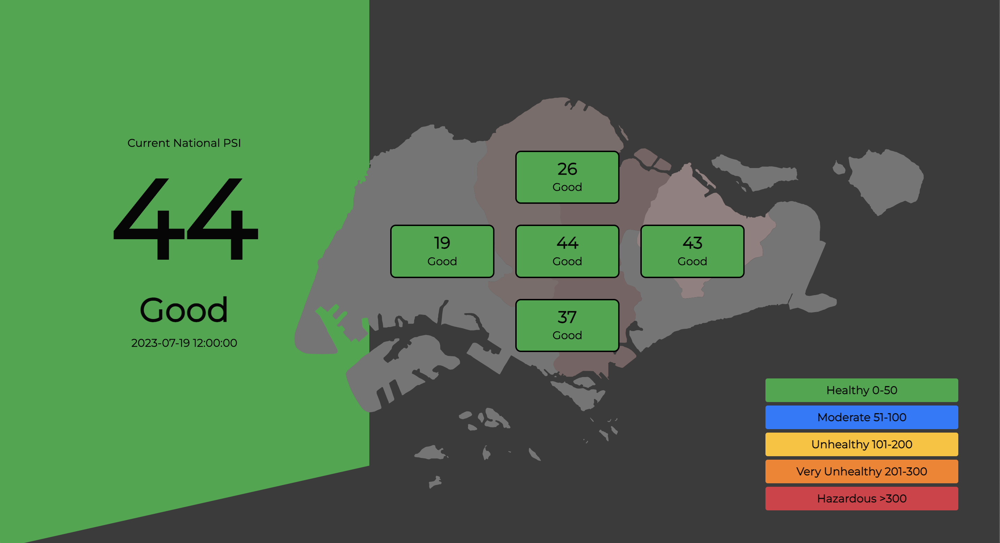
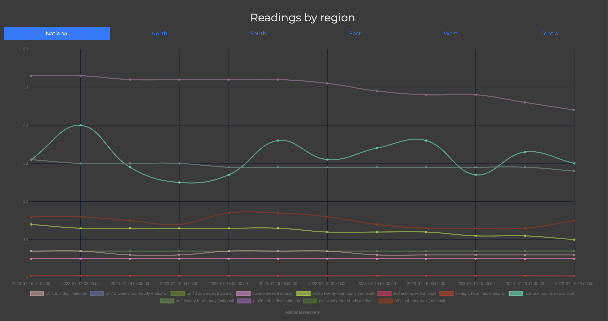
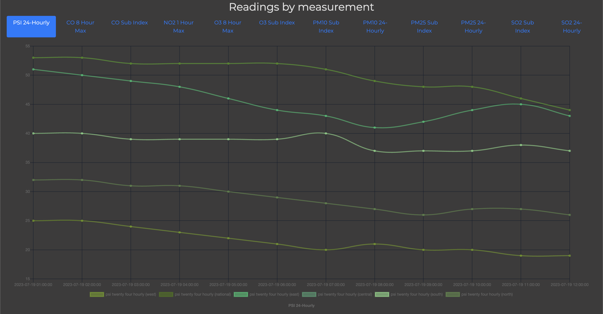
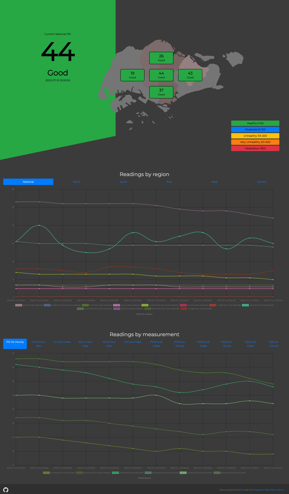

# Air Quality Monitoring Website

With the recent hazy conditions in Singapore, this website was made to monitor the air quality of the island.



Data pulled from [Singapore's PSI API](https://data.gov.sg/dataset/psi) provided under the [Singapore Open Data Licence](https://data.gov.sg/open-data-licence)

Data visualised using [ChartJS](https://www.chartjs.org/) and [Bootstrap](https://getbootstrap.com/)




Built to be responsive as well


# First-Time Setup

```
git clone https://github.com/tohhongxiang123/Haze-monitor.git
cd Haze-monitor
npm install
npm run startx``
```

# Helpful Resources

1. [Data from APIs and Deployment - The Coding Train](https://www.youtube.com/watch?v=ZtLVbJk7KcM&list=PLRqwX-V7Uu6YxDKpFzf_2D84p0cyk4T7X&t=0s)

2. [SASS Crash Course - DesignCourse](https://www.youtube.com/watch?v=roywYSEPSvc)

3. [Graphing with Chart.js - Working With Data & APIs in JavaScript - The Coding Train](https://www.youtube.com/watch?v=5-ptp9tRApM)

4. [overflow:hidden working on desktop, but not on mobile](https://stackoverflow.com/questions/14270084/overflow-xhidden-doesnt-prevent-content-from-overflowing-in-mobile-browsers)

# Full Page Screenshot

